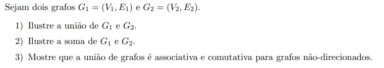

# Teoria dos Grafos e Computabilidade - Lista 01

---

### Resolução 01

Sendo $G_1 = (V_1, E_1)$ e $G_2 = (V_2, E_2)$, a união dos grafos pode ser expressa por:

$$G_1 \cup G_2 = (V_1 \cup V_2, E_1 \cup E_2)$$

Ou seja, não é necessário haja uma aresta conectando os grafos, basta penas considerá-los como um único grafo.

---

### Resolução 02

Sendo $G_1 = (V_1, E_1)$ e $G_2 = (V_2, E_2)$, a soma dos grafos pode ser expressa por:

$$G_1 + G_2 = (V_1 \cup V_2, E_1 \cup E_2 \cup \lbrace u, v \mid u \in V_1, v \in V_2 \rbrace)$$

Ou seja, nesse caso, a soma é a união entre os vértices e arestas dos grafos com a diferença de que todos
vértices do grafo $$G_1$$ serão conectadas com todos os vértices do grafo $$G_2$$.

---

### Resolução 03

A união de grafos é basicamente uma união de conjuntos: tanto dos vértices quanto das arestas. 
Então, os princípios que valem para conjuntos (comutatividade e associatividade) também valem para grafos.

