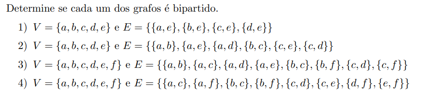

# Teoria dos Grafos e Computabilidade - Lista 01

--- 

### Resolução

Um grafo $G = (V, E)$ é dito bipartido se for possível dividir o conjunto de vértices em dois conjuntos $V_1$ e $V_2$ e que 
todas as arestas de $G$ ligam um vértice de $V_1$ a um vértice de $V_2$.

$$V = V_1 \cup V_2, \quad V_1 \cap V_2 = \emptyset$$

Desse modo, é importante notar que se houver ciclos ímpares é impossível que esse grafo seja bipartido.
Com isso, ao analisar os grafos acima, é possível concluir que somente o terceiro exemplo de grafo não é
bipartido visto que possui ciclo impar formado por três vértices, sendo eles a, b e c